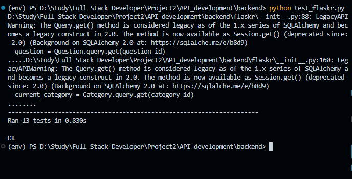

# Backend - Trivia API

## Setting up the Backend

### Install Dependencies

1. **Python 3.8** - Follow instructions to install the latest version of python for your platform in the [python docs](https://docs.python.org/3/using/unix.html#getting-and-installing-the-latest-version-of-python)

2. **Virtual Environment** - We recommend working within a virtual environment whenever using Python for projects. This keeps your dependencies for each project separate and organized. Instructions for setting up a virual environment for your platform can be found in the [python docs](https://packaging.python.org/guides/installing-using-pip-and-virtual-environments/)

3. **PIP Dependencies** - Once your virtual environment is setup and running, install the required dependencies by navigating to the `/backend` directory and running:

```bash
pip install -r requirements.txt
```

#### Key Pip Dependencies

- [Flask](http://flask.pocoo.org/) is a lightweight backend microservices framework. Flask is required to handle requests and responses.

- [SQLAlchemy](https://www.sqlalchemy.org/) is the Python SQL toolkit and ORM we'll use to handle the lightweight SQL database. You'll primarily work in `app.py`and can reference `models.py`.

- [Flask-CORS](https://flask-cors.readthedocs.io/en/latest/#) is the extension we'll use to handle cross-origin requests from our frontend server.

### Set up the Database

With Postgres running, create a `trivia` database:

```bash
createdb trivia
```

Populate the database using the `trivia.psql` file provided. From the `backend` folder in terminal run:

```bash
psql -U postgres trivia
\i 'path:/trivia.psql'
```

### Run the Server

From within the `./src` directory first ensure you are working using your created virtual environment.

To run the server, execute:

```bash
set FLASK_APP=flaskr
set FLASK_ENV=development
flask run --reload
```

The `--reload` flag will detect file changes and restart the server automatically.

## To Do Tasks

These are the files you'd want to edit in the backend:

1. `backend/flaskr/__init__.py`
2. `backend/test_flaskr.py`

One note before you delve into your tasks: for each endpoint, you are expected to define the endpoint and response data. The frontend will be a plentiful resource because it is set up to expect certain endpoints and response data formats already. You should feel free to specify endpoints in your own way; if you do so, make sure to update the frontend or you will get some unexpected behavior.

1. Use Flask-CORS to enable cross-domain requests and set response headers.
2. Create an endpoint to handle `GET` requests for questions, including pagination (every 10 questions). This endpoint should return a list of questions, number of total questions, current category, categories.
3. Create an endpoint to handle `GET` requests for all available categories.
4. Create an endpoint to `DELETE` a question using a question `ID`.
5. Create an endpoint to `POST` a new question, which will require the question and answer text, category, and difficulty score.
6. Create a `POST` endpoint to get questions based on category.
7. Create a `POST` endpoint to get questions based on a search term. It should return any questions for whom the search term is a substring of the question.
8. Create a `POST` endpoint to get questions to play the quiz. This endpoint should take a category and previous question parameters and return a random questions within the given category, if provided, and that is not one of the previous questions.
9. Create error handlers for all expected errors including 400, 404, 422, and 500.

## Documenting your Endpoints

1. `GET '/categories'`

- Fetches a dictionary of categories in which the keys are the ids and the value is the corresponding string of the category
- Request Arguments: None
- Returns: An object with a single key, `categories`, that contains an object of `id: category_string` key: value pairs.

```json
{
  "1": "Science",
  "2": "Art",
  "3": "Geography",
  "4": "History",
  "5": "Entertainment",
  "6": "Sports"
}
```

2. `GET '/questions?page=${Interger}'`

- Fetches a paginated set of questions, a total number of questions, all categories and current category
- Request Arguments: `page` - Integer
- Returns: An object contain a list of paginated question items, total questions, all categories, and current category

```json
{
  "success": true,
  "questions": [
    {
      "id": 1,
      "question": "Hematology is a branch of medicine involving the study of what?",
      "answer": "Blood",
      "category": 3,
      "difficulty": 1
    },
    ...
  ],
  "total_questions": len(questions),
  "categories": {
    "1": "Science",
    "2": "Art",
    "3": "Geography",
    "4": "History",
    "5": "Entertainment",
    "6": "Sports"
  },
  "current_category": "Geography"
}
```

3. `DELETE '/questions/${id}'`

- Deletes a specified question using the id of the question
- Request Arguments: `id` - Integer
- Returns: None

```json
{
  "success": true,
  "message": "Question deleted successfully"
}
```

3. `POST '/questions'`

- Sends a post request to create a new question
- Request Body: json("question": String, "answer": String, "difficulty": Integer, "category": Integer)
- Returns: None

```json 
{
  "success": true,
  "message": "Question created successfully"
}
```

4. `POST '/questions/search'`
  
- Sends a post request to search questions by search term
- Request Body: json("searchTerm": String)
- Returns: An object with list of questions, total questions and current category corresponding with searchTerm.

```json
{
  "success": true,
  "questions": [
    {
      "id": 1,
      "question": "Hematology is a branch of medicine involving the study of what?",
      "answer": "Blood",
      "category": 3,
      "difficulty": 1
    },
    ...
  ],
  "total_questions": len(questions),
  "categories": {
    "1": "Science",
    "2": "Art",
    "3": "Geography",
    "4": "History",
    "5": "Entertainment",
    "6": "Sports"
  },
  "current_category": "Geography"
}
```

5. `GET '/categories/${id}/questions'`
  
- Fetches questions of category by categoryId
- Request Arguments: `id` - Integer
- Returns: An object with list of questions, total questions and current category corresponding with categoryId.

```json
{
  "success": true,
  "questions": [
    {
      "id": 1,
      "question": "Hematology is a branch of medicine involving the study of what?",
      "answer": "Blood",
      "category": 3,
      "difficulty": 1
    },
    ...
  ],
  "total_questions": len(questions),
  "categories": {
    "1": "Science",
    "2": "Art",
    "3": "Geography",
    "4": "History",
    "5": "Entertainment",
    "6": "Sports"
  },
  "current_category": "Geography"
}
```

6. `POST '/quizzes'`
- Sends a post request to get the next random question
- Request Body: json("previous_questions": [1], "quiz_category": "Science")
- Returns: a single new question object

```json
{
  "success": true,
  "question": {
    "id": 1,
    "question": "Hematology is a branch of medicine involving the study of what?",
    "answer": "Blood",
    "category": 3,
    "difficulty": 1
  }
}
```

## Testing

Write at least one test for the success and at least one error behavior of each endpoint using the unittest library.

To deploy the tests, run

```bash
dropdb trivia_test
createdb trivia_test
psql -U postgres trivia_test
\i 'path:/trivia.psql'
python test_flaskr.py
```
